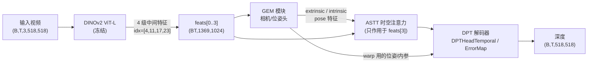

# GemDepth 解码器（DPT / 时序 DPT）与 Warp 代码详解报告

> 范围：本报告聚焦 **解码器**（`model/dpt.py` 的 `DPTHead` 与 `model/dpt_temporal.py` 的
> `DPTHeadTemporal`）以及 **几何/光度 warp 工具**（`model/util/warp.py`）。
> 编码器与非 DPT 部分（DINOv2、GEM、ASTT）只做必要的背景介绍。
>
> 约定（贯穿全文的形状记号）：
> - `B` = batch size，`T` = 序列帧数（`seq_len`，实验里常用 16），`BT = B*T`。
> - 训练裁剪 `crop = 518`，DINOv2 patch = 14，故每帧 token 网格为 `518/14 = 37`，即 `37×37 = 1369` 个 patch token。
> - DINOv2 ViT-L 的 `embed_dim = 1024`。
> - 文中具体张量形状以 `B=1, T=16, crop=518` 为例，便于核对；一般情况把 `16` 换成 `BT` 即可。

---

## 0. 一页总览



- **冻结的部分**：DINOv2 编码器始终冻结；在我们 `head_only` 的实验配置里，连 GEM、ASTT 也一起冻结，**只训练 DPT 解码器 head**。
- **解码器** 是本报告主角：把 4 级编码特征自顶向下融合，回归稠密深度。`dpt.py` 是经典 Depth-Anything DPT 解码器的"底座"，`dpt_temporal.py` 在其上插入 **时序模块**。
- **warp** 是"误差图反馈"研究线的几何核心：用目标帧深度 + GEM 估计的位姿，把邻帧反向投影到目标帧，得到跨帧不一致的"误差图"，再喂回解码器。

---

## 1. 冻结的编码器与非 DPT 部分（背景）

代码入口：`model/gemdepth.py` 的 `GemDepth.forward`。

### 1.1 冻结的编码器：DINOv2 ViT-L

```python
# gemdepth.py __init__
self.pretrained = DINOv2(model_name=encoder)          # encoder='vitl'
self.intermediate_layer_idx = {'vitl': [4, 11, 17, 23]}
# forward
features = self.pretrained.get_intermediate_layers(
    x.flatten(0,1), self.intermediate_layer_idx[self.encoder], return_class_token=True)
```

- 输入 `x = (B,T,3,518,518)`，先 `flatten(0,1)` 成 `(BT,3,518,518)` 再过 DINOv2。
- 取 **第 4/11/17/23 层** 的中间输出作为 4 级特征金字塔，每级形状 `(BT, 1369, 1024)`，外加每级的 class token `(BT, 1024)`。
- **冻结**：`train.py` 中 `model.pretrained.requires_grad_(False)` —— 编码器在任何配置下都不更新。

### 1.2 非 DPT 部分：GEM（相机/位姿）与 ASTT（时空注意力）

这两块在解码器之前运行，**为 warp 提供几何**、并对最深一层特征做时空增强：

1. **GEM 模块**（生成位姿/内参）：
   - 把 `camera_token + register_token + feats[3]` 拼接，依次过 `frame_blocks`（帧内注意力）与 `global_blocks`（跨帧全局注意力）。
   - 把帧内/全局中间结果拼接送入 `camera_head`，得到 `pose_enc_list`；再由 `pose_encoding_to_extri_intri` 解码出
     **`extrinsic (B,T,4,4)` 与 `intrinsic (B,T,3,3)`** —— 这正是 warp 要用的相机外参/内参。
   - 另有 `cam_rot_encoder / cam_trans_encoder / cam_trans_scale_encoder` 把位姿编码成可加到特征上的 pose 特征。

2. **ASTT 模块**（交替空间-时间注意力，只作用于 `feats[3]`）：
   ```python
   for m in range(3,4):                      # 仅最深一层
       feats[m] = feats[m] + pose特征…       # 注入位姿信息
       feats[m] = self.dec_norm(feats[m]) + image_pos
       for blk1, blk2 in zip(self.spatial_blocks, self.time_blocks):
           feats[m] = blk1(feats[m], pos[m]) # 空间注意力（带 RoPE）
           feats[m] = blk2(feats[m])         # 时间注意力（跨 T）
   ```
   - 结果 `features_attn = tuple(zip(feats, tokens))` 作为解码器输入；其中只有 `feats[3]` 被时空增强，`feats[0..2]` 保持编码器原样。

3. **送入解码器**：
   ```python
   if self.head_type in ('errormap','errormap_coattn'):
       depth = self.head(features_attn, patch_h, patch_w, T,
                         images=input_images, extrinsics=extrinsic, intrinsics=intrinsic)
   else:                                       # temporal 基线
       depth = self.head(features_attn, patch_h, patch_w, T)
   depth = F.interpolate(depth, size=(H,W)); depth = F.relu(depth)
   return depth.squeeze(1).unflatten(0,(B,T)), pose_enc_list, extrinsic, intrinsic
   ```

### 1.3 `head_only` 冻结：只训练解码器

```python
# train.py
if freeze_mode == 'head_only':
    for p in model.parameters():      p.requires_grad_(False)
    for p in model.head.parameters(): p.requires_grad_(True)   # 只放开 DPT head
```

所以在我们的对照实验里，**编码器 + GEM + ASTT 全部冻结**，梯度只流向 DPT 解码器（含误差图模块）。这让"误差图是否带来增益"成为一个干净的受控变量。

---

## 2. 解码器逐层详解（`dpt.py` 与 `dpt_temporal.py`）

### 2.1 `DPTHead`（`model/dpt.py`）的组件

`DPTHead.__init__` 定义了 4 大组件：

| 组件 | 定义 | 作用 |
|---|---|---|
| `projects` | 4 个 `Conv2d(1024 → out_channels[i], k=1)` | 把每级 token 特征投影到金字塔通道数 `[256,512,1024,1024]` |
| `resize_layers` | `[ConvT(×4), ConvT(×2), Identity, Conv(÷2)]` | 把同样 `37×37` 的 4 级特征 **重采样到不同分辨率**，形成真正的金字塔 |
| `scratch.layerX_rn` | 4 个 `Conv2d(out_channels[i] → features=256, k=3, bias=False)` | 把 4 级统一到 `256` 通道，进入融合 |
| `scratch.refinenet1..4` | 4 个 `FeatureFusionBlock(256)` | 自顶向下逐级上采样融合 |
| `output_conv1/2` | `Conv(256→128)` → 上采样 → `Conv(128→32)→ReLU→Conv(32→1)→ReLU` | 回归 1 通道深度 |

`resize_layers` 细节（关键，决定金字塔分辨率）：

| level i | 输入(投影后) | resize 层 | 输出分辨率 | 输出通道 |
|---|---|---|---|---|
| 0 → `layer_1` | `37×37` | `ConvTranspose2d(k=4,s=4)` | `148×148` | 256 |
| 1 → `layer_2` | `37×37` | `ConvTranspose2d(k=2,s=2)` | `74×74` | 512 |
| 2 → `layer_3` | `37×37` | `Identity` | `37×37` | 1024 |
| 3 → `layer_4` | `37×37` | `Conv2d(k=3,s=2,p=1)` | `19×19` | 1024 |

### 2.2 Token 重组 → 4 级特征金字塔

`forward` 第一段（`dpt.py` 与 `dpt_temporal.py` 完全一致）：

```python
for i, x in enumerate(out_features):
    x = x[0]                                              # 取特征(忽略 cls，除非 use_clstoken)
    x = x.permute(0,2,1).reshape(BT, 1024, 37, 37)        # token 序列 → 2D 特征图
    x = self.projects[i](x)                               # 1×1 投影到 out_channels[i]
    x = self.resize_layers[i](x)                          # 重采样到该级分辨率
    out.append(x)
layer_1, layer_2, layer_3, layer_4 = out
```

得到（以 `BT=16`）：

| 张量 | 形状 |
|---|---|
| `layer_1` | `(16, 256, 148, 148)` |
| `layer_2` | `(16, 512, 74, 74)` |
| `layer_3` | `(16, 1024, 37, 37)` |
| `layer_4` | `(16, 1024, 19, 19)` |

### 2.3 `scratch.layerX_rn` 统一通道 + 自顶向下融合

```python
layer_1_rn = self.scratch.layer1_rn(layer_1)   # (16,256,148,148)
layer_2_rn = self.scratch.layer2_rn(layer_2)   # (16,256, 74, 74)
layer_3_rn = self.scratch.layer3_rn(layer_3)   # (16,256, 37, 37)
layer_4_rn = self.scratch.layer4_rn(layer_4)   # (16,256, 19, 19)

path_4 = refinenet4(layer_4_rn,        size=37)   # (16,256, 37, 37)
path_3 = refinenet3(path_4, layer_3_rn, size=74)  # (16,256, 74, 74)
path_2 = refinenet2(path_3, layer_2_rn, size=148) # (16,256,148,148)
path_1 = refinenet1(path_2, layer_1_rn)           # (16,256,296,296)  ×2 上采样
```

**`FeatureFusionBlock` 内部**（`model/util/blocks.py`）：

- 由两个 `ResidualConvUnit`（`ReLU→Conv3×3→ReLU→Conv3×3`，再残差相加）构成。
- `forward(*xs, size)`：
  1. `output = xs[0]`（上层来的粗特征）。
  2. 若 `len(xs)==3`（即同时传入 skip 特征）：`output += resConfUnit1(xs[1])` —— 把同级编码特征作为 skip 融入。
  3. `output = resConfUnit2(output)`。
  4. 按 `size`（或默认 `scale_factor=2`）双线性 **上采样**。
  5. `output = out_conv(output)`（1×1 卷积，`256→256`）。
- 因此 `refinenet4` 只有一个输入（顶层，无 skip），`refinenet3/2/1` 各有一个 skip（对应 `layer_3/2/1_rn`）。`refinenet1` 无 `size` 参数 → 默认 `×2`，把 `148→296`。

### 2.4 输出头

```python
out = output_conv1(path_1)                                  # (16,128,296,296)
out = F.interpolate(out, (37*14, 37*14))                    # (16,128,518,518)
out = output_conv2(out.float())                             # (16,  1,518,518)  两次 ReLU → 非负
```

回到 `gemdepth.forward`：再 `interpolate` 到原图 `(H,W)`、`relu`、`squeeze+unflatten`，最终 `(B,T,518,518)` 深度。

### 2.5 `dpt.py` 的 `forward` 是"参考实现"——在 GemDepth 中并不执行

`DPTHead.forward(out_features, patch_h, patch_w)` 是经典 Depth-Anything 的 DPT 解码流程，逻辑与上面一致，但 **没有 `mode` 参数**，调用融合块时是 `refinenet4(layer_4_rn, size=...)`。

⚠️ **重要差异**：本仓库把 `FeatureFusionBlock.forward` 改成了 `mode = xs[-1]`（最后一个位置参数当作 bf16 开关）。这意味着：
- `dpt.py` 基类的 `forward`（不传 `mode`）会把张量当成 `mode`，在 `if mode:` 处对多元素张量做布尔判断而报错；
- 因此在 GemDepth 里 **真正被执行的是 `DPTHeadTemporal.forward`（或其误差图子类）**，它们都正确地把 `mode` 作为最后一个位置参数传给融合块。
- 一句话：**`dpt.py` 提供"结构与组件"（`__init__` 被子类 `super().__init__` 复用）以及一份经典 forward 参考；GemDepth 运行时走的是 `dpt_temporal.py` 的 forward。**

### 2.6 `DPTHeadTemporal`（`model/dpt_temporal.py`）：在解码器里插入时序模块

`DPTHeadTemporal(DPTHead)` 复用 `DPTHead` 的全部组件，并新增 **4 个 `TemporalModule`**（跨帧时间注意力，`zero_initialize=True` → 初始即恒等残差）：

```python
self.motion_modules = nn.ModuleList([
    TemporalModule(in_channels=out_channels[2]),  # [0] 作用于 layer_3 (1024ch, 37×37)
    TemporalModule(in_channels=out_channels[3]),  # [1] 作用于 layer_4 (1024ch, 19×19)
    TemporalModule(in_channels=features),         # [2] 作用于 path_4  ( 256ch, 37×37)
    TemporalModule(in_channels=features),         # [3] 作用于 path_3  ( 256ch, 74×74)
])
```

`forward` 中的插入位置（其余与基类一致）：

```python
# 1) 金字塔特征构建后，对两条"深层"编码特征做时序注意力
layer_3 = motion_modules[0](layer_3)     # (B,T,1024,37,37) → 同形
layer_4 = motion_modules[1](layer_4)     # (B,T,1024,19,19) → 同形

# 1.5) 可选外部注入点（基线为 None；供 GEM/ASTT 侧特征相加）
if layer_3_att is not None: layer_3 = layer_3_att + layer_3
if layer_4_att is not None: layer_4 = layer_4_att + layer_4

# 2) RN + 顶层融合后，对两条"解码路径"特征做时序注意力
path_4 = refinenet4(layer_4_rn, mode, size=37)
path_4 = motion_modules[2](path_4)       # (B,T,256,37,37) → 同形
path_3 = refinenet3(path_4, layer_3_rn, mode, size=74)
path_3 = motion_modules[3](path_3)       # (B,T,256,74,74) → 同形
path_2 = refinenet2(path_3, layer_2_rn, mode, size=148)
path_1 = refinenet1(path_2, layer_1_rn, mode)
```

`TemporalModule` 把 `(B,T,C,H,W)` 在每个空间位置上跨 `T` 帧做自注意力（带可选位置编码 `pe`），输出投影 **零初始化**，所以训练起点等价于基线 DPT，再逐渐学到时间一致性。

> `mode` 透传：`DPTHeadTemporal.forward` 内部把 `mode` 固定为 `False`，并作为最后一个位置参数传给每个 `refinenet`，使融合块走 fp32 双线性上采样分支（与 `autocast` 配合）。

### 2.7 `dpt.py` vs `dpt_temporal.py` 对照

| 维度 | `DPTHead`（`dpt.py`） | `DPTHeadTemporal`（`dpt_temporal.py`） |
|---|---|---|
| 角色 | 经典 Depth-Anything DPT 底座 + 参考 forward | GemDepth 实际执行的解码器 |
| 输入签名 | `forward(out_features, patch_h, patch_w)` | `forward(..., frame_length, layer_3_att=None, layer_4_att=None, mode=None)` |
| 帧维度 | 无（按 `BT` 当独立图像） | 显式 `frame_length=T`，用 `unflatten(0,(B,T))` 还原帧维做时序注意力 |
| 时序模块 | 无 | 4 个 `TemporalModule`（layer_3 / layer_4 / path_4 / path_3），零初始化 |
| 外部注入点 | 无 | `layer_3_att / layer_4_att`（基线为 None） |
| 融合块调用 | `refinenet(x, size=…)` | `refinenet(x, [skip,] mode, size=…)`（多传 `mode`） |
| 是否在 GemDepth 运行 | 否（仅 `__init__` 被复用） | 是 |
| 组件（projects/resize/scratch/refinenet/output_conv） | 定义于此 | 完全继承复用 |

> **误差图子类**（`dpt_errormap.py` / `dpt_errormap_coattn.py`）再继承 `DPTHeadTemporal`，在 `path_4(s4) / path_3(s3) / path_2(s2)` 三个阶段插入"解码粗深度 → warp → 误差图 → 注入"的 `_inject` 步骤，其几何核心就是下一节的 warp。

---

## 3. Warp 代码逐步详解（`model/util/warp.py`）

该文件有 3 个对外函数 + 1 个内部核函数：

| 函数 | 作用 |
|---|---|
| `scale_intrinsics` | 把内参从原图分辨率缩放到当前特征分辨率 |
| `_inverse_warp` | **核函数**：用目标帧深度把源帧反向 warp 到目标帧 |
| `signal_error_map` | 对任意逐像素信号做"最小重投影误差图"（多 offset 取最小） |
| `photometric_error_map` | `signal_error_map` 的 RGB 薄封装（v1 兼容） |

### 3.1 `scale_intrinsics(K, src_hw, dst_hw)`

误差图是在解码器某一阶段（如 `37×37`）算的，但内参 `K` 是相对原图分辨率定义的，必须先缩放：

```python
sx = w/W0;  sy = h/H0
K2[...,0,0] *= sx   # fx
K2[...,0,2] *= sx   # cx
K2[...,1,1] *= sy   # fy
K2[...,1,2] *= sy   # cy
```

即 `fx,cx` 按宽度比例、`fy,cy` 按高度比例缩放，`K` 形状 `(B,T,3,3)` 不变。

### 3.2 `_inverse_warp(...)`：反向 warp 的 8 个步骤

输入（均已把 `B*n` 压到第 0 维，记作 `N`）：目标帧深度 `depth_t (N,1,H,W)`、源帧信号 `img_s (N,C,H,W)`、目标帧逆内参 `inv_K_t`、源帧内参 `K_s`、两帧外参 `ext_t / ext_s (N,4,4, world→camera)`。

```text
步骤 1  生成目标帧像素齐次坐标网格 pix = [u, v, 1]ᵀ，形状 (N,3,H*W)
步骤 2  反投影到目标相机系：cam_t = (inv_K_t · pix) · depth_t        # 像素 → 3D 点
步骤 3  齐次化 cam_t_h = [cam_t; 1]                                   # (N,4,H*W)
步骤 4  相对位姿 M = ext_s · inv(ext_t)                              # 目标相机系 → 源相机系
步骤 5  变换到源相机系 cam_s = (M · cam_t_h)[:, :3]
步骤 6  投影到源像素：proj = K_s · cam_s; u_s=proj_x/z, v_s=proj_y/z  # z 用 eps 保护
步骤 7  归一化到 [-1,1] 采样网格 grid，并 F.grid_sample(img_s, grid) # 双线性、zeros padding
步骤 8  有效掩码 valid = 在界内(|gx|,|gy|≤1) & z>eps & depth_t>0
返回    warped (N,C,H,W), valid (N,1,H,W)
```

要点：
- 这是 **inverse warping**：对每个 *目标* 像素，算它在 *源* 帧里的位置，再去源帧采样 —— 因此 `warped` 与目标帧像素网格对齐，可直接和目标信号逐像素相减。
- `M = ext_s · inv(ext_t)` 把"目标相机坐标"变到"源相机坐标"，几何上等价于"目标点在世界系里的位置，再投到源相机"。
- `valid` 把越界、深度非正、`z≤eps`（点在相机后方）的像素标记为无效，后续误差不在这些位置计入。

### 3.3 `signal_error_map(signal, depth, K, extrinsics, offsets=(-1,1), ...)`

对一段视频信号 `signal (B,T,C,H,W)` 计算 **最小重投影误差图**（monodepth2 的 min-reprojection 思想）：

```python
for o in offsets:                       # 默认 (-1, +1)：用前一帧和后一帧
    idx_t = 有效目标帧索引;  idx_s = idx_t + o   # 边界帧自动跳过
    # 取出目标/源信号、目标深度、内参、外参，压平到 N=B*n
    warped, valid = _inverse_warp(d_t, sig_s, invKt, Ks, Tt, Ts)
    residual = (sig_t - warped).abs().mean(dim=1, keepdim=True)   # 逐像素 L1（通道平均）
    # —— 可视化捕获钩子（capture 非空时记录，不影响数值）——
    residual = residual*valid + big*(1-valid)     # 无效像素填 big，避免被 min 选中
    # 把该 offset 的 (residual, valid) 放回 (B,T,1,H,W) 的全长张量
err  = torch.stack(err_stack).min(dim=0)          # 跨 offset 取逐像素最小残差
valid = torch.stack(valid_stack).max(dim=0)       # 任一 offset 有效即有效
err = err * valid                                 # 无效处归零
return err, valid                                  # (B,T,1,H,W), (B,T,1,H,W)
```

设计要点：
- **min-reprojection**：同一目标像素同时尝试"借前一帧/后一帧"，取残差更小的那个，能天然规避遮挡/出画（被遮的那侧残差大，会被另一侧的 min 替换）。
- **`big` 填充**：无效像素先填一个大值 `big`，确保在 `min` 时不会被误选；最后再用 `valid` 把无效处的 `err` 归零。
- **边界帧**：`offsets` 会让首/末帧缺少某一侧邻帧，循环里用 `t0,t1` 自动裁掉，不会越界。
- **通用性**：`signal` 可以是 RGB（光度误差）、解码器特征（特征误差）、HOG（梯度方向误差）等 —— 这正是方案 C 四个臂"只改输入信号、其余不变"的受控点。

#### 可视化捕获钩子（我们新增、默认关闭）

```python
if capture is not None:                 # capture 传入一个 list 时才记录
    capture.append({
        'tag', 'offset', 'idx_t', 'idx_s',
        'target': sig_t, 'source': sig_s, 'warped': warped,
        'error':  residual*valid, 'valid': valid,   # 均 detach 到 CPU
    })
```

- 默认 `capture=None` → 这段完全跳过，**warp 的数学与返回值零改动**。
- 传入 list 时，每次 warp 把 `target/source/warped/error/valid` 存下来，供 `scripts/visualize_warp.py` 画成"流程图"面板（`source+depth → warped → |target−warped| → error map`）。

### 3.4 `photometric_error_map(...)`

```python
def photometric_error_map(images, depth, K, extrinsics, offsets=(-1,1), ..., capture=None, tag=''):
    return signal_error_map(images, depth, K, extrinsics, offsets=offsets, ..., capture=capture, tag=tag)
```

只是把 `signal=images` 的 `signal_error_map`，保留给 v1 误差图头（`dpt_errormap.py`）做向后兼容。

### 3.5 warp 在解码器里如何被调用（串起来）

以 v1 头 `DPTHeadErrorMap._inject(key, path_feat, images, extrinsics, intrinsics, B, T)` 为例（`key ∈ {s4,s3,s2}`）：

```text
1. depth_s = depth_heads[key](path_feat)            # 该阶段解码一张"粗深度"(Softplus>0)
2. imgs    = 把输入 RGB 下采样到该阶段分辨率 (h,w)
3. K       = scale_intrinsics(intrinsic, 原图→(h,w)) # 内参缩放到该阶段
4. err,valid = photometric_error_map(imgs, depth_s, K, ext, offsets)   # ← warp 在此发生
5. err_feat = error_encoders[key]([err,valid])      # 2ch → 特征，零初始化
6. return path_feat + err_feat                       # 残差注入，初始为恒等
```

- 阶段分辨率：`s4 = 37×37`、`s3 = 74×74`、`s2 = 148×148`（即 `path_4 / path_3 / path_2`）。
- 方案 C 头 `DPTHeadErrorMapCoAttn._inject` 类似，但对每个模态各算一张误差图，再用零初始化的 **co-attention** 融合后注入。
- 因为编码器都是 **零初始化注入**，模型起点等价于基线，warp 误差只在训练中"按需"改变解码特征。

---

## 4. warp 各步 ↔ 可视化面板对应

`scripts/visualize_warp.py` 的每张图正好把上面 warp 的关键中间量画出来：

| 面板 | 对应 warp 量 |
|---|---|
| `source` | `_inverse_warp` 的输入 `img_s`（未 warp 的邻帧） |
| `depth` | 驱动 warp 的 `depth_t`（GT 模式=真值；in-model 模式=预测） |
| `warped` | `_inverse_warp` 输出的 `warped`（源帧采样到目标网格） |
| `target` | `sig_t`（目标帧真实信号） |
| `error map` | `signal_error_map` 的 `err = |target − warped|`（已掩无效） |

箭头语义：`source + depth --warp(depth+pose)--> warped`，`warped + target --|残差|--> error map`。

> 数值自检（GT 几何模式）：warped 残差比"不 warp 直接相减"低约 **69–75%**，说明 `_inverse_warp` 的几何实现正确。

---

## 附：关键文件与行为速查

| 文件 | 关键内容 |
|---|---|
| `model/gemdepth.py` | 编码器调用、GEM、ASTT、`head` 选择与 forward 串联 |
| `model/dpt.py` | `DPTHead`：projects / resize_layers / scratch / refinenet / output_conv + 参考 forward |
| `model/dpt_temporal.py` | `DPTHeadTemporal`：4 个 `TemporalModule` 插入位置 + `mode` 透传（GemDepth 实际执行） |
| `model/util/blocks.py` | `_make_scratch` / `ResidualConvUnit` / `FeatureFusionBlock`（融合块内部） |
| `model/util/warp.py` | `scale_intrinsics` / `_inverse_warp` / `signal_error_map` / `photometric_error_map` |
| `model/dpt_errormap*.py` | 继承时序头，在 s4/s3/s2 调 warp 生成误差图并注入 |
| `scripts/visualize_warp.py` | 把每次 warp 画成流程图面板（GT 几何 / in-model 两种模式） |
| `train.py` | `pretrained.requires_grad_(False)` + `head_only` 冻结策略 |
